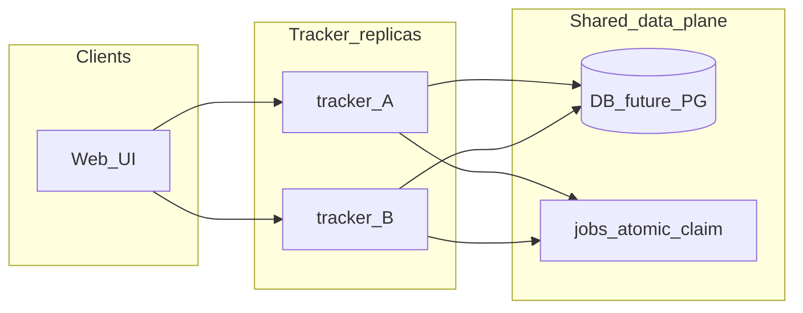

# 部署与多实例

## Docker（单副本）

```bash
docker compose up --build
```

- 默认端口 **8080**，SQLite 数据在命名卷 `tracker_data`（容器内 `/data/tracker.db`）。
- 环境变量与 CLI 一致：`TRACKER_DB_PATH`、`TRACKER_PORT`、`TRACKER_INSTANCE_ID` 等。

镜像构建：根目录 `Dockerfile` 多阶段构建 `web/dist` + `cmd/tracker`。

## 实例标识与任务抢占

- 每个进程可设置 **`TRACKER_INSTANCE_ID`**（任意稳定字符串，如 `k8s-pod-name`）。异步任务从 `pending` 被抢占为 `running` 时，会写入 `jobs.claimed_by` / `claimed_at`，便于排查哪台实例在执行。
- **`ClaimNextPendingJob`** 使用「先选 id + `UPDATE ... WHERE id=? AND status='pending'`」避免双实例同时执行同一 job（在**同一数据库**上并发抢任务时，只有一个 `UPDATE` 会成功）。

## 连接池

- SQLite：`internal/storage/sqlite.go` 在 `Open` 后设置 `SetMaxOpenConns` / `SetMaxIdleConns`（规模较小；多实例时仍受 SQLite 单机写锁限制）。
- 迁移到 **PostgreSQL** 等网络库时，应提高 `MaxOpenConns`、设置 `ConnMaxLifetime`，并在文档中给出推荐值。

## 多副本（水平扩展）前置条件

**不要将多个 Tracker 副本挂载同一个 SQLite 文件做高并发写入**（锁竞争与损坏风险）。扩展路径建议：

1. **共享状态**：使用 PostgreSQL（或 MySQL）存放 `pipeline_definitions`、`jobs`、业务表。
2. **任务队列**：`jobs` 表上使用 **`SELECT ... FOR UPDATE SKIP LOCKED`**（PostgreSQL）或等价原子抢占语义；或引入 Redis Stream / SQS 等外部队列，Worker 仅消费队列。
3. **无状态 API**：多实例前置同一 DB；上传/会话若需要可再加 Redis。
4. **Phase 2（未在本仓库实现）**：存储抽象层、迁移脚本、Compose/K8s 示例中的 PG 服务。

当前代码以 **SQLite + 原子抢占** 为默认；文档与 `docker-compose.yml` 描述单副本；多副本架构见上文与下方示意图。



## Makefile 常用命令

见仓库根目录 `Makefile`：`make build-all`、`make docker-build`、`make web-build` 等。
