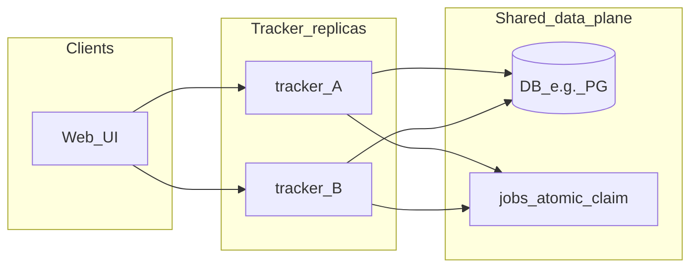

# Deployment and multi-instance

## Docker (single replica)

```bash
docker compose up --build
```

- Default port **8080**; SQLite lives in named volume `tracker_data` at `/data/tracker.db` in the container.
- Environment variables mirror the CLI: `TRACKER_DB_PATH`, `TRACKER_PORT`, `TRACKER_INSTANCE_ID`, etc.

The root `Dockerfile` is multi-stage: build `web/dist`, then compile `cmd/tracker`.

## Instance ID and job claiming

- Set **`TRACKER_INSTANCE_ID`** per process (stable string, e.g. Kubernetes pod name). When a job moves from `pending` to `running`, `jobs.claimed_by` and `jobs.claimed_at` are set for troubleshooting.
- **`ClaimNextPendingJob`** uses “pick id, then `UPDATE ... WHERE id=? AND status='pending'`” so only one concurrent claim succeeds against the same row.

## Release metadata and feature flags

- Recommended release envs: `TRACKER_RELEASE_CHANNEL`, `TRACKER_RELEASE_RING`, `TRACKER_RELEASE_VERSION`, `TRACKER_RELEASE_INSTANCE`.
- Emergency override env: `TRACKER_FLAG_OVERRIDES` (for example `runtime.executor_v2=legacy`).
- For rollout policy and rollback steps, see [ROLLOUT_AB.md](ROLLOUT_AB.md) and [OPERATIONS_SOP.md](OPERATIONS_SOP.md).

## Connection pools

- SQLite: `internal/storage/sqlite.go` sets `SetMaxOpenConns` / `SetMaxIdleConns` after `Open` (conservative; multiple writers to one file still hit SQLite locking).
- For **PostgreSQL** or similar, raise `MaxOpenConns`, set `ConnMaxLifetime`, and document recommended values for ops.

## Horizontal scaling prerequisites

**Do not point many Tracker replicas at the same SQLite file for heavy concurrent writes** (locking and corruption risk). Suggested direction:

1. **Shared state**: PostgreSQL (or MySQL) for `pipeline_definitions`, `jobs`, and app tables.
2. **Work queue**: **`SELECT ... FOR UPDATE SKIP LOCKED`** on `jobs` (PostgreSQL) or an external queue (Redis Stream, SQS, …).
3. **Stateless API**: replicas share one DB; add Redis if you need sessions or uploads.
4. **Future (not fully in this repo)**: storage abstraction, migrations, sample PG in Compose/K8s.

Today the stack defaults to **SQLite + atomic claim**; `docker-compose.yml` describes a single replica. The diagram shows the target shape for multiple replicas.



## Makefile

See the repo root `Makefile`: `make build-all`, `make docker-build`, `make web-build`, etc.

## See also

- UI and API: [WEB_UI.md](WEB_UI.md)
- Pipeline model: [PIPELINE_GRAPH.md](PIPELINE_GRAPH.md)
