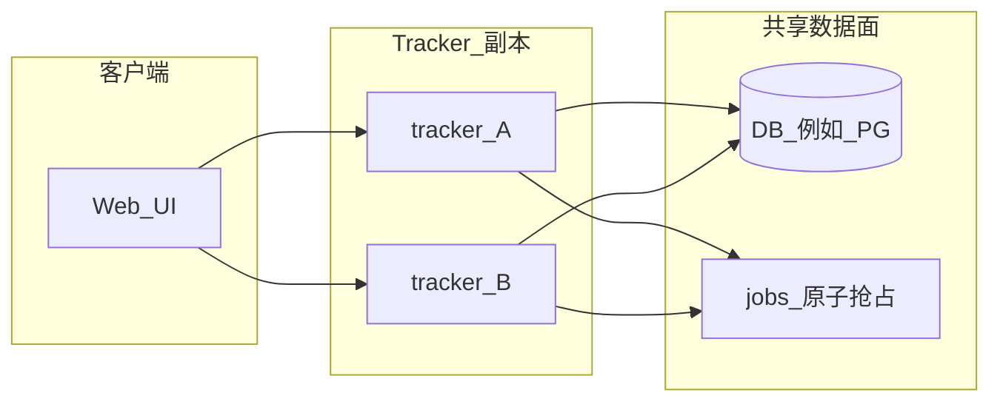

# 部署与多实例

## Docker（单副本）

```bash
docker compose up --build
```

- 默认端口 **8080**；SQLite 数据在命名卷 `tracker_data`（容器内路径 `/data/tracker.db`）。
- 环境变量与 CLI 一致，例如 `TRACKER_DB_PATH`、`TRACKER_PORT`、`TRACKER_INSTANCE_ID`。

镜像由根目录 `Dockerfile` 多阶段构建：先构建 `web/dist`，再编译 `cmd/tracker`。

## 实例标识与任务抢占

- 每个进程可设置 **`TRACKER_INSTANCE_ID`**（稳定字符串，例如 K8s Pod 名）。异步任务从 `pending` 被抢占为 `running` 时写入 `jobs.claimed_by`、`jobs.claimed_at`，便于排查执行实例。
- **`ClaimNextPendingJob`** 使用「先选定 id，再 `UPDATE ... WHERE id=? AND status='pending'`」的方式，在同一数据库上并发抢任务时只有一个 `UPDATE` 会成功。

## 连接池

- SQLite：`internal/storage/sqlite.go` 在 `Open` 后设置 `SetMaxOpenConns`、`SetMaxIdleConns`（数值较保守；多进程写同一 SQLite 文件仍会受写锁限制）。
- 若迁移到 **PostgreSQL** 等网络数据库，应提高 `MaxOpenConns`、设置 `ConnMaxLifetime`，并在运维文档中写明推荐值。

## 水平扩展的前置条件

**不要将多个 Tracker 副本对同一 SQLite 文件做高并发写入**（锁竞争与损坏风险）。建议路径：

1. **共享状态**：使用 PostgreSQL（或 MySQL）存放 `pipeline_definitions`、`jobs` 等业务表。
2. **任务队列**：在 `jobs` 表上使用 **`SELECT ... FOR UPDATE SKIP LOCKED`**（PostgreSQL）或等价原子抢占；或引入 Redis Stream、SQS 等，Worker 只消费队列。
3. **无状态 API**：多实例前置同一数据库；若需要会话或上传，可再加 Redis。
4. **后续阶段（本仓库未完整实现）**：存储抽象、迁移脚本、Compose/K8s 中的 PG 示例。

当前默认实现为 **SQLite + 原子抢占**；`docker-compose.yml` 描述单副本；下图表示多副本时的数据面关系。



## Makefile

仓库根目录 `Makefile` 提供 `make build-all`、`make docker-build`、`make web-build` 等命令。

## 相关文档

- 界面与 API：[WEB_UI.md](WEB_UI.md)
- 管道模型：[PIPELINE_GRAPH.md](PIPELINE_GRAPH.md)
